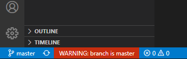

# Branch Warnings

Alerts you when you are working on a branch you have designated "protected" such as master. Can help to remember not to commit to the wrong branch.



## Extension Settings

This extension contributes the following settings:

* `branchwarnings.suppressPopup`: Suppress the more intrusive warning dialog when first switching to a protected branch (only show the warning on the status bar).

* `branchwarnings.protectedBranches`: An array of branch names. If it exists, warnings will be shown for these names.

* `branchwarnings.msgColor`: Allows you to change the color of the message on the status bar.

* `branchwarnings.warningText`: Allows you to change the warning status bar message prefix. The default message prefix value is "WARNING: branch is ".

* `branchwarnings.warningPopup`: Allows you to change the warning popup message. The default message prefix value is "WARNING: you are on the protected branch ".

* `branchwarnings.warnIfRemoteBranchExistsMatchingRegex`: If set, will also provide a status warning if a branch matching the regex exists remotely. It can be used to encourage or remind users to consider if their change should go on a existing release branch, etc. If set also consider setting the "warnIfRemoteBranchExistsMatchingMsg" and "warnIfRemoteBranchExistsMatchingMsgColor" settings

* `branchwarnings.warnIfRemoteBranchExistsMatchingMsg`: If "warnIfRemoteBranchExistsMatchingRegex" is set then this allows you to override the default message prefix which is "WARNING: A release branch exists ".

* `branchwarnings.warnIfRemoteBranchExistsMatchingMsgColor`: If "warnIfRemoteBranchExistsMatchingRegex" is set then this allows you to override the message color which is "#ffa500". 

By default, warnings will be given for branches titled "master". If you wish to warn when working on another branch such as "prerelease", add to your workspace or user settings:
```
"branchwarnings.protectedBranches": [ "master", "prerelease", "releases/**" ]
```
